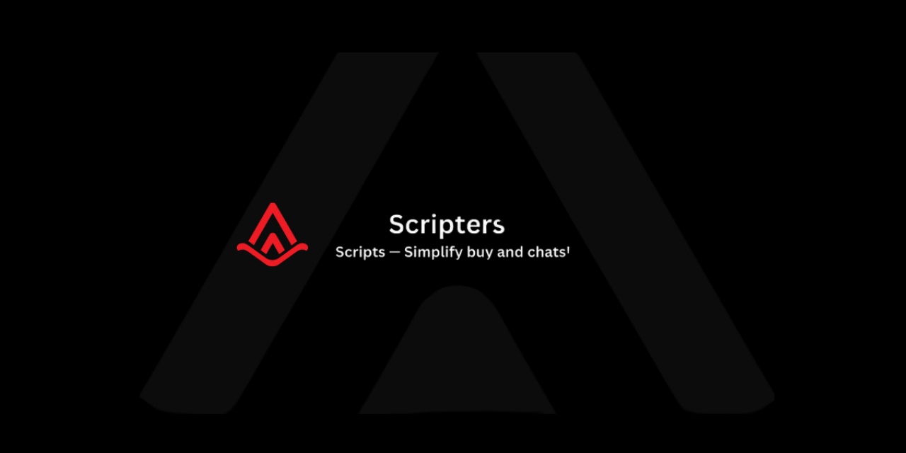

# Scripts
Scripts — Simplify buy and chats!
# Scripts — Simplify Buy and Chats!

  

Welcome to **Scripts**, your go-to marketplace for seamless digital goods transactions using cryptocurrency. Whether you're looking for reliable tools, scripts, or other digital assets, we've got you covered with a secure and user-friendly platform.

---

## 🌟 Features

### 🔒 Trusted and Secure Marketplace
Your transactions are protected with cutting-edge security protocols, ensuring a worry-free experience.

### 🎁 Simple Solutions for Crypto Transactions
Effortlessly buy and sell digital goods using cryptocurrency. No complications, just simplicity.

### 🌐 Easy Access
Join our community on Telegram: [ScriptsChats](https://t.me/ScriptsChats) to explore, discuss, and find what you need.

---

## 🚀 How to Get Started

1. **Explore the Marketplace**  
   Visit [Scripts Shop](https://scripts-shop.vercel.app/) to browse through our curated collection of digital goods.

2. **Connect and Buy**  
   Use cryptocurrency to securely purchase what you need.

3. **Join the Community**  
   Interact with other buyers and sellers on [ScriptsChats Telegram](https://t.me/ScriptsChats).

---

## 🛡️ Why Choose Scripts?

- **Fast and Reliable:** Enjoy smooth transactions without delays.  
- **Transparent:** Clear processes and upfront pricing.  
- **Supportive Community:** Connect with like-minded individuals on our Telegram channel.

---

## 📜 License

This project is licensed under the [Apache-2.0 License](LICENSE).

---

## 📢 Connect with Us

- **Website:** [scripts-shop.vercel.app](https://scripts-shop.vercel.app/)  
- **Telegram Community:** [ScriptsChats](https://t.me/ScriptsChats)

Simplify your buying experience with **Scripts** — the trusted, secure marketplace for digital goods.
